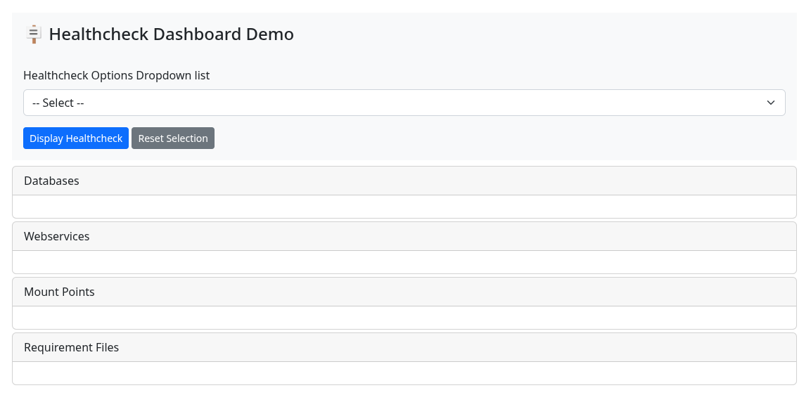

# 🧪 Health Check Research and Development (R&D) Project

This R&D proof-of-concept project explores the development of a standardized health check system tailored for Python-based applications. Its purpose is to detect the availability and accessibility of application dependencies and support robust service monitoring.

While the immediate outcome is not the creation of a reusable library, the core objective is to inform and guide future efforts toward developing a generic Python library that developers can integrate to assess application status, performance metrics, and service availability.

The concept will be demonstrated using FastAPI—a modern, high-performance web framework compatible with Python 3.13 —alongside a standalone HTML page that displays the health check results in a user-friendly format. This approach illustrates both backend integration and frontend visualization, offering a blueprint for future adoption across diverse Python environments.

## 🦯 Core Feature Implementation Checklist

- [x] Implement diagnostic routine to verify TCP connectivity to external endpoints based on hostname or IP address and designated port.
- [x] Validate presence of all Python packages specified in the `requirements.txt` manifest.
- [x] Conduct availability checks for remote HTTP-based APIs, ensuring availability of the service.
- [x] Detect and confirm active mount status of filesystem targets essential to application runtime dependencies.

[📖 Core Features Description](howto/CORE_FEATURES.md "Core Features Description")

## ✨ Proof of Concept Implementation

### ⚙️ FastAPI Routes

| HTTP Method | Endpoint         | Description                       | Who Can Access? | 
|-------------|------------------|-----------------------------------|------------------|
| GET         | /healthcheck     | Returns overall health status of the health checks with a details list of each category       | Public  |
| GET         | /healthcheck/databases        | Returns overall health status of databases checklist a details list of each database       | Admin User  |
| GET         | /healthcheck/mountpoints       | Returns overall health status of the mount points health checks with a details list of each mount point       | Admin User   |
| GET         | /healthcheck/webservices        | Returns overall health status of the health checks of registered webservice api with a details list of each webservice       | Admin User   |
| GET         | /healthcheck/requirements        | Returns overall health status of the health checks of requirements files      | Admin User   |

### 🌐 HTML Demo

* A **dropdown menu** with the following options: [All,Databases, Webservices, Mount points, Requirement Files].
* A **submit button** that triggers the display of the selected category.
* A **reset button** reset all regions and dropdown menu selection.
* A **status view** that shows the health status of the selected option.

can be accessed throught

* http://localhost:8000
* http://localhost:8000/static/dashboard-demo.html

Dashboard screenshoot

## 🚀 Deployment and Usage Procedures

[📦 Deploy the application on a container engine (e.g., Docker, Podman) and conduct testing](howto/BAREMETAL.md "Deploy the application on a container engine (e.g., Docker, Podman) and conduct testing")

[📘 Follow the documented procedures for application usage and operation](howto/USAGE_OPERATION.md "Follow the documented procedures for application usage and operation")

## 📋 Run environemnt prerequisites

* 🐍 Python 3.13
* 🐳 Docker/ 🦭 Podman
* Internet connection

## 📦 Libraries Used

### 🐍 Python Backend Application

| Tool/Library       | Purpose                                                                 |
|--------------------|-------------------------------------------------------------------------|
| **FastAPI**         | Web framework for building RESTful APIs using Python type hints.        |
| **Uvicorn**         | ASGI server for running FastAPI apps in production.                     |

### 🌐 Frontend (HTML Demo Page)

| Tool/Library       | Purpose                                                                 |
|--------------------|-------------------------------------------------------------------------|
| **BootStrap CSS**    | CSS framework for responsive design.                      |
| **fetch API**       | Native JavaScript method for making HTTP GET call FastAPI.       |

### 🧪 Testing & CI/CD

| Tool/Library       | Purpose                                                                 |
|--------------------|-------------------------------------------------------------------------|
| **Pytest**          | Framework for writing and running tests.                                |
| **pytest-html**     | Generates HTML reports from Pytest results.                             |
| **Selenium**        | Automates browser-based UI testing.                                     |
| **TestClient (FastAPI)** | Tests FastAPI routes without running a live server.               |